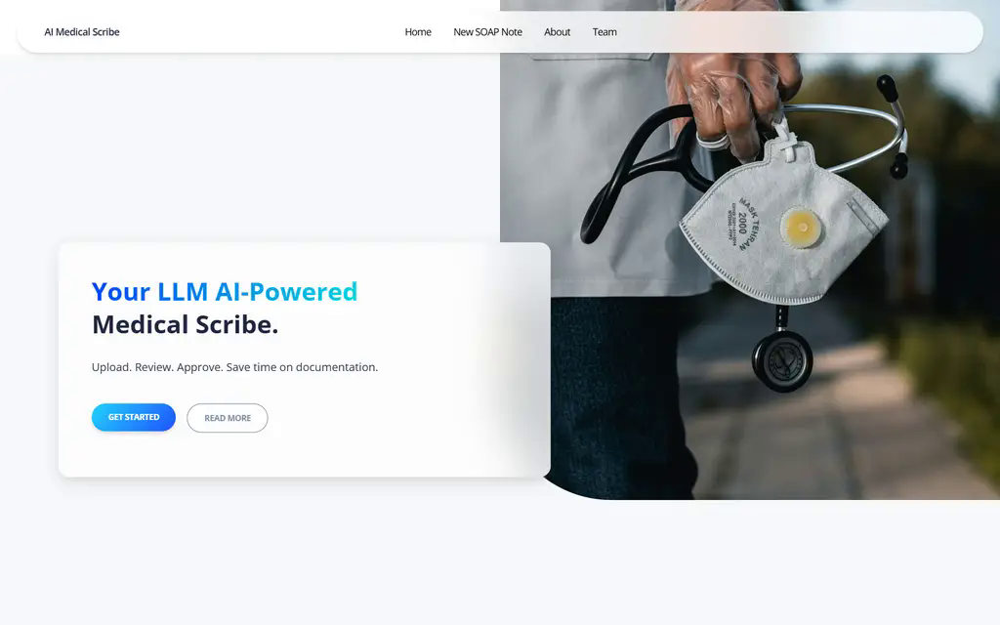
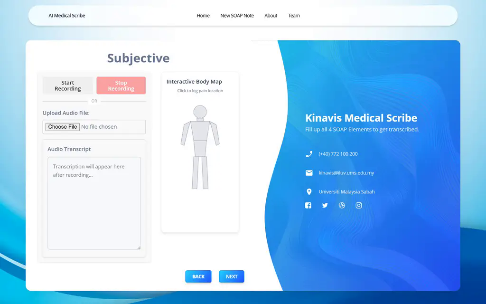
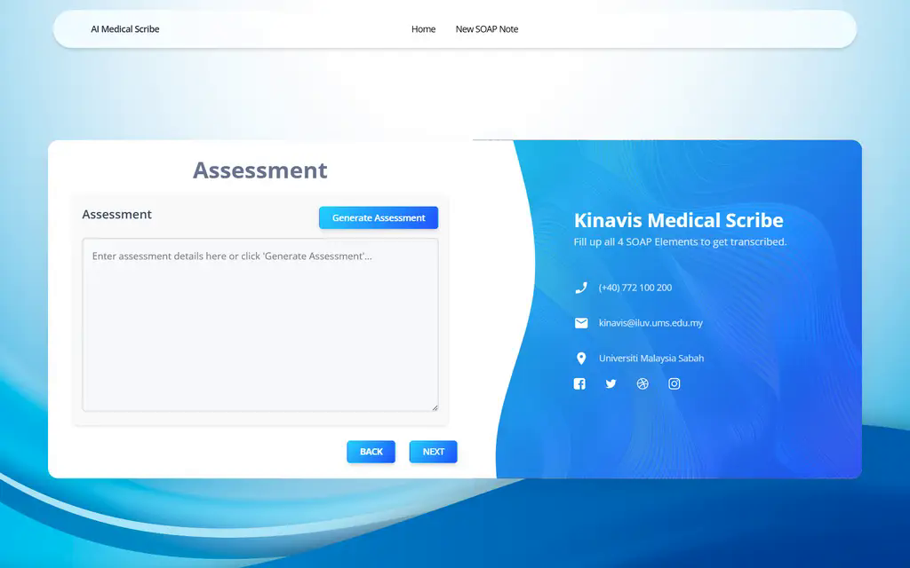
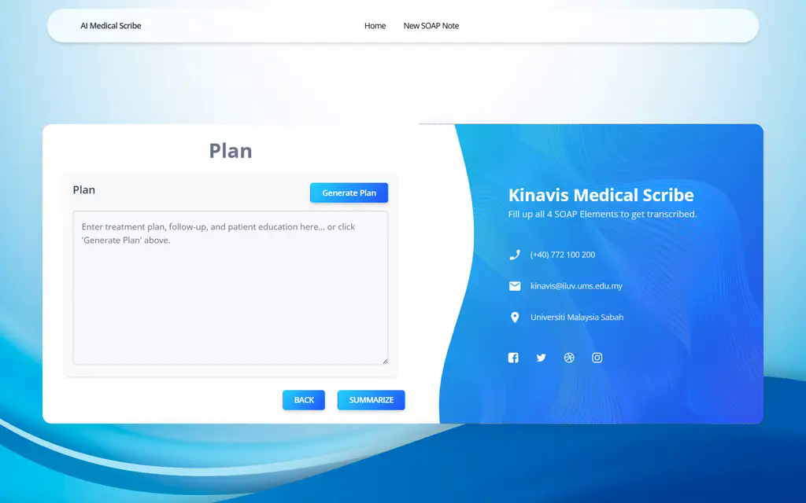
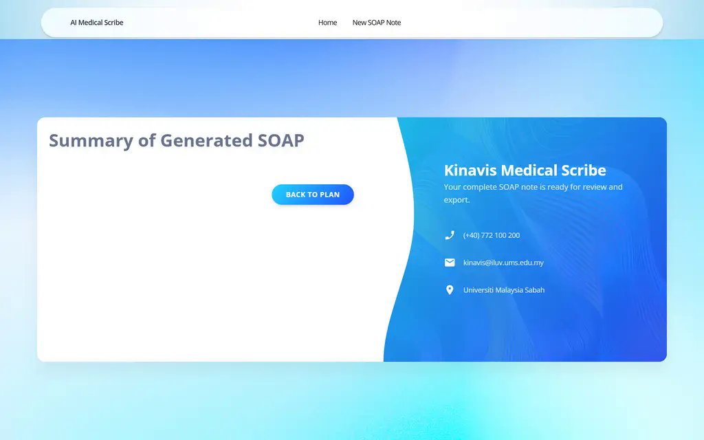
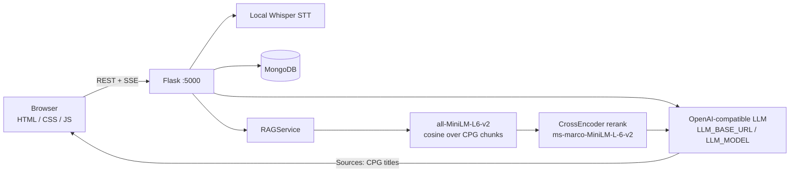

# AIMS Medical Scribe

Clinical SOAP notes from consult audio. Local Whisper transcribes. An OpenAI-compatible LLM drafts Assessment / Plan / Summary, grounded in Malaysian CPG chunks (MiniLM retrieve + CrossEncoder rerank). Clinician reviews before save.

**Demo:** [http://localhost:5000](http://localhost:5000)

## Preview

Landing page:



SOAP workflow (Subjective → Assessment → Plan → Summary):

| Subjective | Assessment |
|---|---|
|  |  |
| **Plan** | **Summary** |
|  |  |

## Architecture



1. Browser records or uploads audio → Flask → Whisper (local, no cloud STT).
2. Transcript + vitals land in Mongo (`aims_medical_scribe`).
3. Generate Assessment / Plan / Summary streams from the LLM.
4. RAG injects the top 3 CPG snippets (400 chars each) and appends a `Sources:` footer of retrieved titles — not LLM-invented `[1]` markers.

## Stack

| Layer | What runs |
|---|---|
| UI | Vanilla HTML / CSS / JS, served by Flask |
| API | Python 3.11, Flask, `python -m backend.app` |
| STT | Local OpenAI Whisper (`WHISPER_MODEL`, default `medium`) |
| LLM | OpenAI SDK against `LLM_BASE_URL` (default `https://api.hcnsec.cn/v1`), model `LLM_MODEL` (default `glm-5.3-flash`) |
| RAG | `sentence-transformers/all-MiniLM-L6-v2` + `cross-encoder/ms-marco-MiniLM-L-6-v2` over `backend/rag/corpus/clinical_practical_guide/*.jsonl` |
| DB | MongoDB (`MONGO_URI`, default `mongodb://127.0.0.1:27017`) |

Not used at runtime: Google Gemini / Vertex, Google Cloud STT, SQLite, Ollama.

## Setup

Prerequisites: Python 3.9+, FFmpeg, Docker Desktop (local Mongo), an OpenAI-compatible API key.

```bash
cp .env.example .env          # set LLM_API_KEY
docker start aims-mongo || docker run -d --name aims-mongo -p 27017:27017 mongo:7
python -m venv venv
# Windows: .\venv\Scripts\activate
# Linux/Mac: source venv/bin/activate
pip install -r requirements.txt
python -m backend.app         # use the venv python
```

Windows: `start.bat` / `start.ps1` starts Mongo if Docker is up.

Open [http://localhost:5000](http://localhost:5000). Do not start a second `python -m backend.app` — port 5000 is already bound.

`.env` is gitignored. Do not commit the live key or `backend/rag/corpus/**/*.npz` (MiniLM cache; rebuilds on first generate if missing).

## Workflow

1. **Subjective** — record / upload consult audio, edit transcript, mark pain on the body map.
2. **Objective** — vitals and findings.
3. **Assessment** — Generate; review streamed text + `Sources:` CPG titles.
4. **Plan** — Generate treatment / follow-up the same way.
5. **Summary** — combined SOAP, export TXT/PDF.

## Layout

```
AIMS-final-mvp/
├── backend/
│   ├── app.py                 # Flask entry (reloader off)
│   ├── config.py              # load_dotenv + LLM / Whisper / Mongo
│   ├── database.py            # Mongo
│   ├── routes/                # notes, speech, …
│   ├── services/              # whisper STT, OpenAI-compatible LLM
│   └── rag/                   # MiniLM retrieve + CrossEncoder
├── frontend/                  # SOAP pages + static assets
├── rag_cpg_pipeline/          # offline CPG PDF → JSONL (optional)
├── docs/preview/              # UI screenshots
├── .env.example
└── requirements.txt
```

## Troubleshooting

| Symptom | Fix |
|---|---|
| Mongo errors | `docker start aims-mongo` |
| LLM 401 / empty generate | `LLM_API_KEY` / `LLM_BASE_URL` in `.env`. Reasoning models need a real `max_tokens` (do not cap at 8). |
| First Generate is slow / RAM ~600MB | MiniLM + CrossEncoder lazy-load on first Assessment. Use the **venv** python; system Python on :5000 will skip the venv models. |
| Whisper missing / slow | First run downloads the model. `WHISPER_MODEL=small` if RAM is tight. FFmpeg required. |
| `Failed to fetch` on Generate | Something killed Flask (often OOM from a huge embedder). Confirm one listener on :5000. |
| Stale CPG ranking | Delete `backend/rag/corpus/clinical_practical_guide/minilm_l6_v2_embeddings.npz` and generate once to re-embed. |

## License / support

In development; licensing TBD. Contact the KinaVis team for clinical or technical questions.
